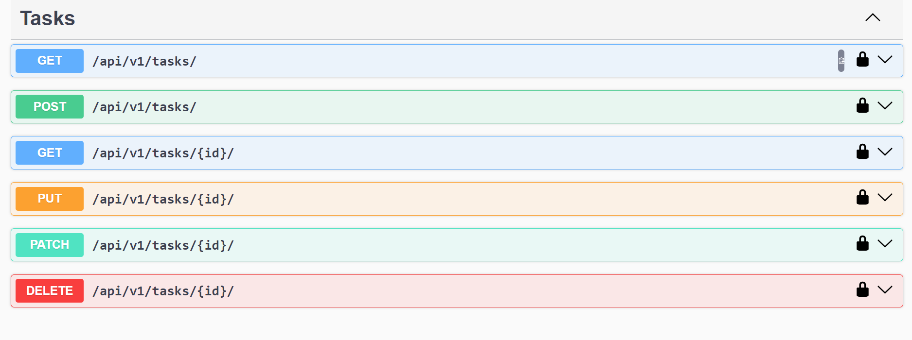
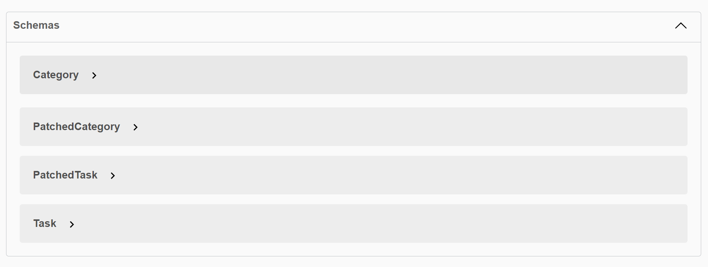
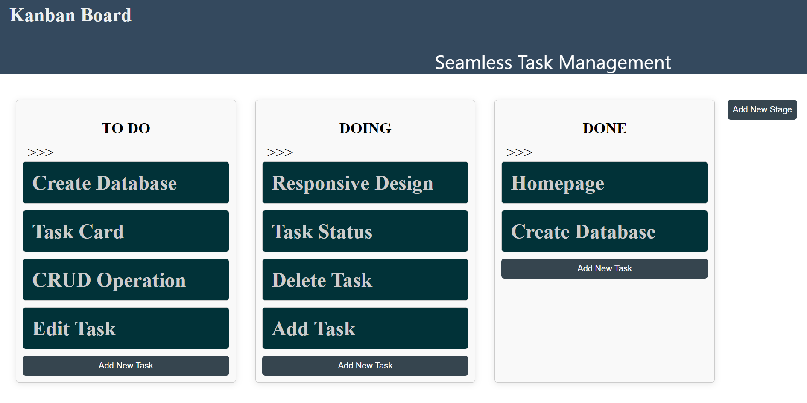
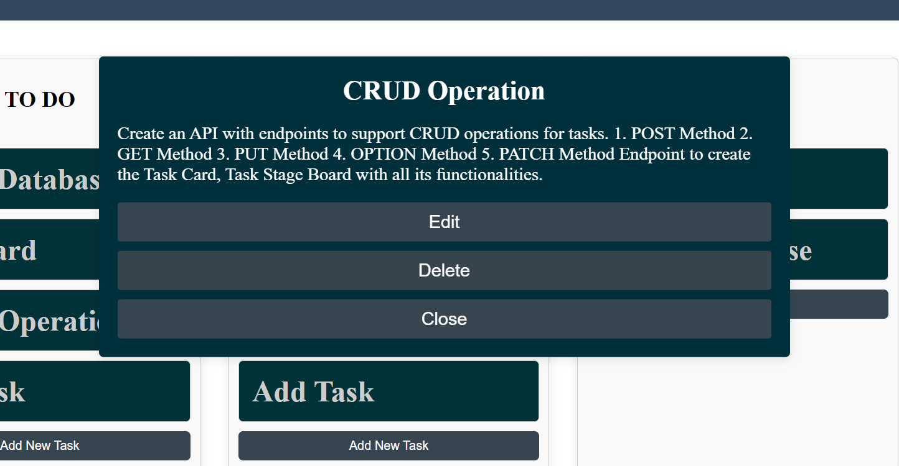
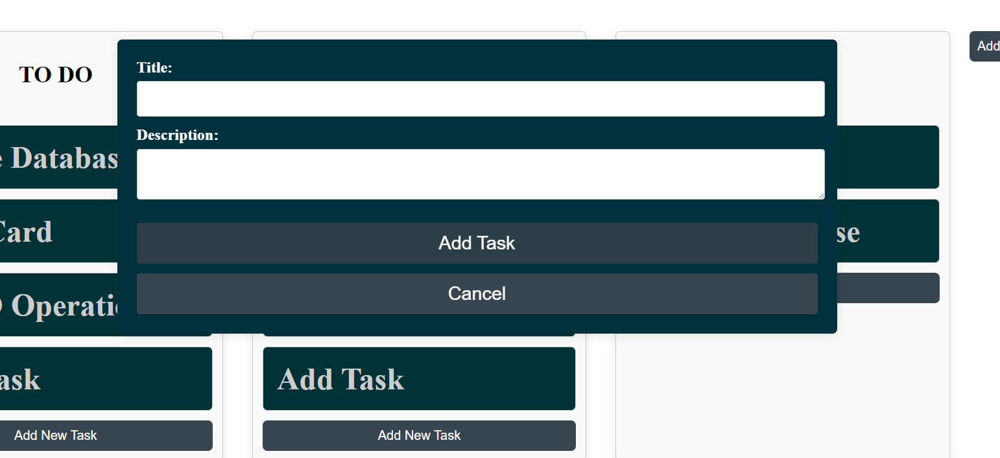
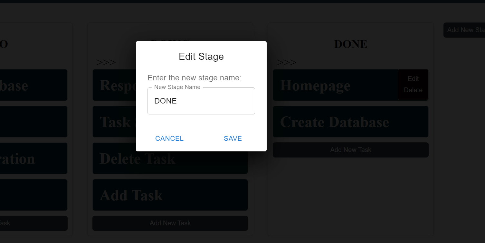

### TASK MANAGEMENT PROJECT WITH DJANGO REST FRAMEWORK AND REACT

## BACKEND

# Task Management Django Rest Framework(DRF) API Documentation

This repository contains the backend API for a Task Stage Board application, implemented using Django Rest Framework (DRF).

## API Endpoints

### Categories

#### List and Create Categories

Endpoint: `/api/v1/categories/`

Method: GET (List all categories), POST (Create a new category)

#### Retrieve, Update, and Delete Category

Endpoint: `/api/v1/categories/{category_id}/`

Method: GET (Retrieve a category), PUT (Update a category), DELETE (Delete a category)

### Tasks

#### List and Create Tasks

Endpoint: `/api/v1/tasks/`

Method: GET (List all tasks), POST (Create a new task)

#### Retrieve, Update, and Delete Task

Endpoint: `/api/v1/tasks/{task_id}/`

Method: GET (Retrieve a task), PUT (Update a task), DELETE (Delete a task)

## Implementation Details

### Categories

- `CategoryListCreateView`: List and create categories.
- `CategoryRetrieveUpdateDelentView`: Retrieve, update, and delete a category.

### Tasks

- `TaskListCreateView`: List and create tasks.
- `TaskRetrieveUpdateDeleteView`: Retrieve, update, and delete a task.

## Documentation





For more detailed information about the API endpoints, request and response formats, please refer to the API documentation.

## Setup and Usage

1. Clone the repository.
2. Create a virtual environment and activate it.
3. Install the required dependencies: `pip install -r requirements.txt`.
4. Configure your database settings in `settings.py`.
5. Run database migrations: `python manage.py migrate`.
6. Start the development server: `python manage.py runserver`.

## FRONTEND

## React + Vite + Kanban Board Task Management Frontend

# Task Board React App

The Task Board React App is a simple task management tool built using React. It allows you to create, organize, and manage tasks on a visual board with customizable stages.









## Features

- Drag-and-drop functionality to move tasks between stages.
- Create, edit, and delete tasks.
- Add, edit, and delete stages.
- Intuitive user interface for managing tasks and stages.

## Technologies Used

- React + vite configurations
- React Beautiful DND for drag-and-drop functionality
- Material-UI for dialogs and user interface components

## Installation

1. Clone this repository to your local machine:

   ```bash
   git clone https://github.com/usanaphtal112/Task-management.git
   ```

   2. Change directory to the project folder:

   ```bash
   cd Task-Management
   ```

   3. Install the required dependencies:

   ```bash
   npm install
   ```

   4. Start the development server:

   ```bash
   npm run dev
   ```

   Open your web browser!

## Usage

1. Add new tasks to a stage by clicking the "Add New Task" button in the respective stage column.

2. Edit a task by clicking on it and making changes in the Task Details Popup.

3. Delete a task by clicking the "Delete" button in the Task Details Popup.

4. Create a new stage by clicking the "Add New Stage" button at the top.

5. Edit a stage by clicking the "Edit" button in the stage options.

6. Delete a stage by clicking the "Delete" button in the stage options.
   This template provides a minimal setup to get React working in Vite with HMR and some ESLint rules.
