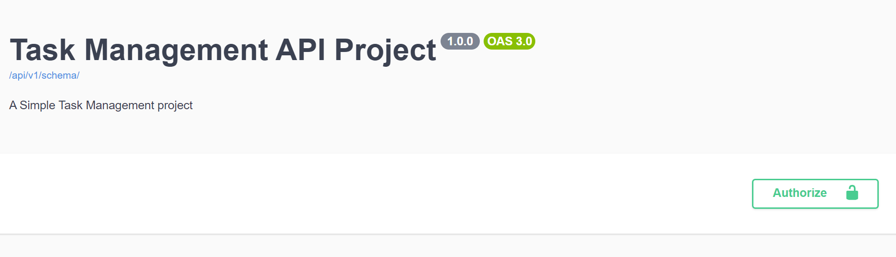
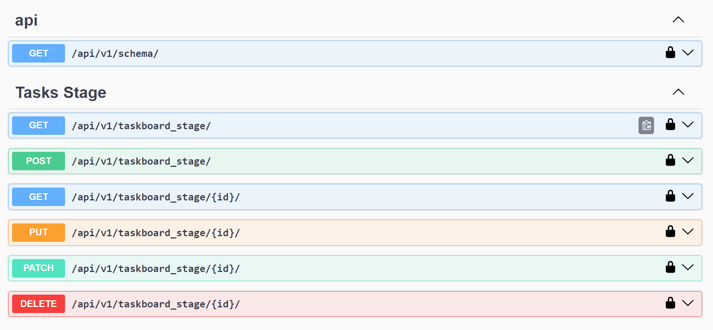
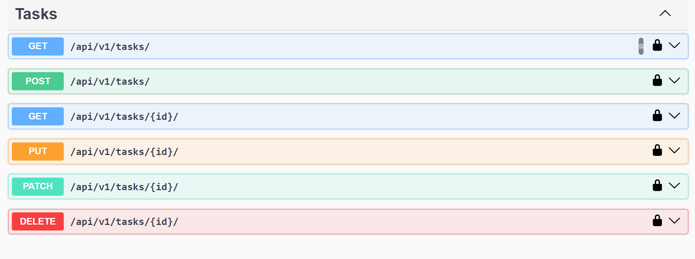
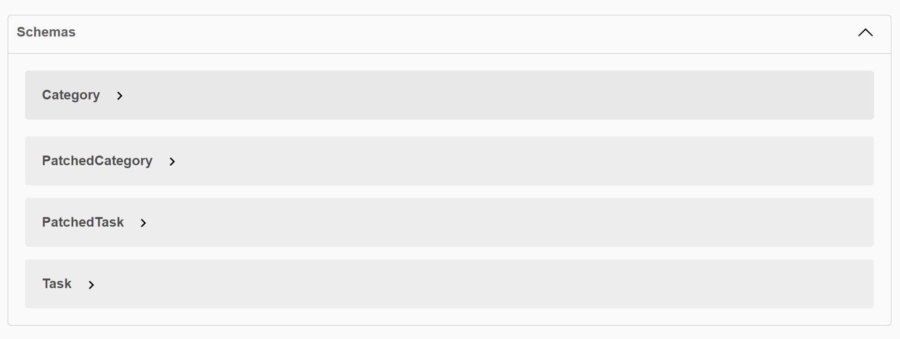

# Task Management Django Rest Framework(DRF) API Documentation

This repository contains the backend API for a Task Stage Board application, implemented using Django Rest Framework (DRF).

## API Endpoints

### Categories

#### List and Create Categories

Endpoint: `/api/v1/categories/`

Method: GET (List all categories), POST (Create a new category)

#### Retrieve, Update, and Delete Category

Endpoint: `/api/v1/categories/{category_id}/`

Method: GET (Retrieve a category), PUT (Update a category), DELETE (Delete a category)

### Tasks

#### List and Create Tasks

Endpoint: `/api/v1/tasks/`

Method: GET (List all tasks), POST (Create a new task)

#### Retrieve, Update, and Delete Task

Endpoint: `/api/v1/tasks/{task_id}/`

Method: GET (Retrieve a task), PUT (Update a task), DELETE (Delete a task)

## Implementation Details

### Categories

- `CategoryListCreateView`: List and create categories.
- `CategoryRetrieveUpdateDelentView`: Retrieve, update, and delete a category.

### Tasks

- `TaskListCreateView`: List and create tasks.
- `TaskRetrieveUpdateDeleteView`: Retrieve, update, and delete a task.

## Documentation

For more detailed information about the API endpoints, request and response formats, please refer to the API documentation.

## Setup and Usage

1. Clone the repository.
2. Create a virtual environment and activate it.
3. Install the required dependencies: `pip install -r requirements.txt`.
4. Configure your database settings in `settings.py`.
5. Run database migrations: `python manage.py migrate`.
6. Start the development server: `python manage.py runserver`.
