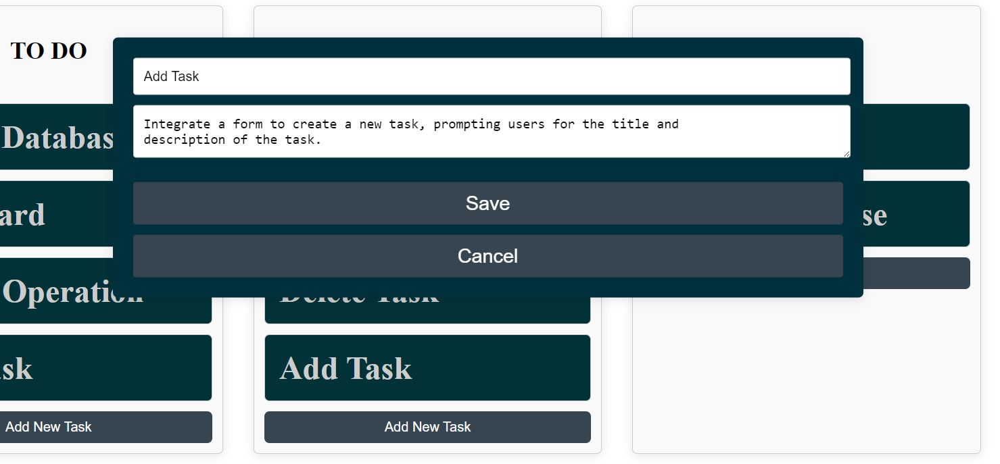

## React + Vite + Kanban Board Task Management Frontend

# Task Board React App

The Task Board React App is a simple task management tool built using React. It allows you to create, organize, and manage tasks on a visual board with customizable stages.





## Features

- Drag-and-drop functionality to move tasks between stages.
- Create, edit, and delete tasks.
- Add, edit, and delete stages.
- Intuitive user interface for managing tasks and stages.

## Technologies Used

- React + vite configurations
- React Beautiful DND for drag-and-drop functionality
- Material-UI for dialogs and user interface components

## Installation

1. Clone this repository to your local machine:

   ```bash
   git clone https://github.com/usanaphtal112/Task-management.git
   ```

   2. Change directory to the project folder:

   ```bash
   cd Task-Management
   ```

   3. Install the required dependencies:

   ```bash
   npm install
   ```

   4. Start the development server:

   ```bash
   npm run dev
   ```

   Open your web browser!

## Usage

1. Add new tasks to a stage by clicking the "Add New Task" button in the respective stage column.

2. Edit a task by clicking on it and making changes in the Task Details Popup.

3. Delete a task by clicking the "Delete" button in the Task Details Popup.

4. Create a new stage by clicking the "Add New Stage" button at the top.

5. Edit a stage by clicking the "Edit" button in the stage options.

6. Delete a stage by clicking the "Delete" button in the stage options.
   This template provides a minimal setup to get React working in Vite with HMR and some ESLint rules.

Currently, two official plugins are available:

- [@vitejs/plugin-react](https://github.com/vitejs/vite-plugin-react/blob/main/packages/plugin-react/README.md) uses [Babel](https://babeljs.io/) for Fast Refresh
- [@vitejs/plugin-react-swc](https://github.com/vitejs/vite-plugin-react-swc) uses [SWC](https://swc.rs/) for Fast Refresh
